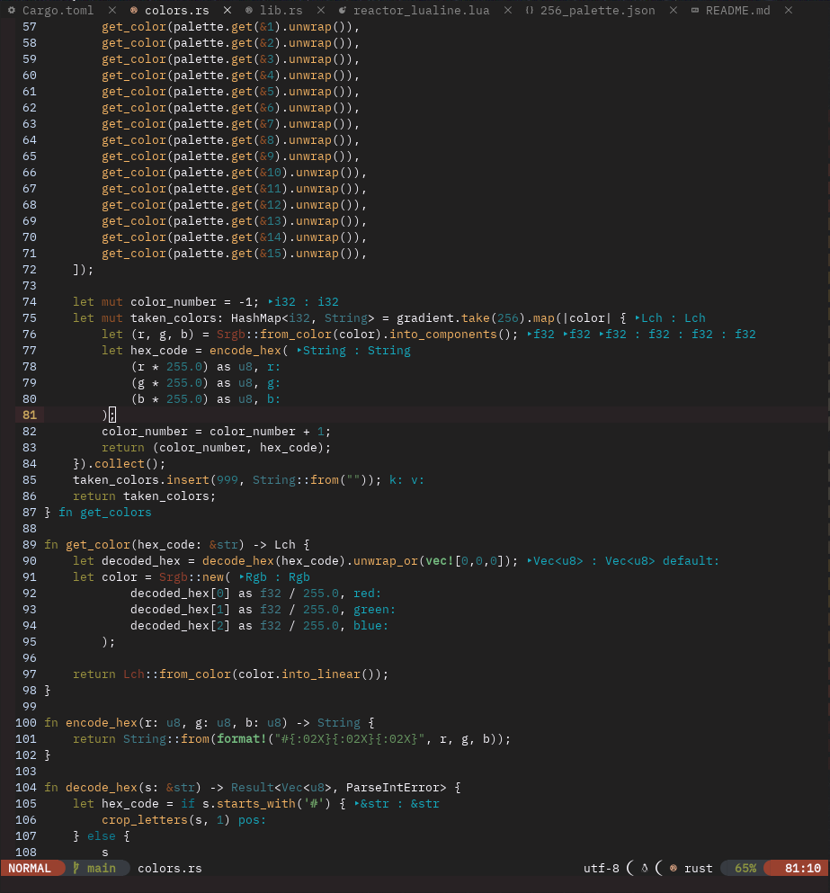

# Reactor Colorscheme

## Screenshots

### Rust


### HTML


### Javascript


### CSS


### Lua


### Telescope


## Installation

## Packer

```lua
use { 'NachiketNamjoshi/reactor.nvim', run = './install.sh' }
```

## Plug

```vimscript
Plug 'NachiketNamjoshi/reactor.nvim', { 'do': './install.sh' }
```

## Usage

## Basic Colorscheme

You can use the theme just like other themes:

Vimscript:

```vimscript
colorscheme reactor
```

Lua:

```lua
vim.cmd.colorscheme("reactor")
-- vim.cmd.colorscheme "reactor"
-- vim.cmd("colorscheme reactor")
-- vim.cmd[[colorscheme reactor]]
```

## Lualine

You will need to require the `Lualine` theme from the `colors` in your `Lualine`
config:

```lua
local ok, reactor = pcall(require, 'reactor_lualine')
if ok then
  lualine_opts['theme'] = reactor.LualineTheme;
else
  lualine_opts['theme'] = 'some_other_theme'
end

lualine.setup {
  options = lualine_opts
}
```

## Credits

- [oxocarbon.nvim](https://github.com/shaunsingh/oxocarbon.nvim)
- [nvim-oxi](https://github.com/noib3/nvim-oxi)
